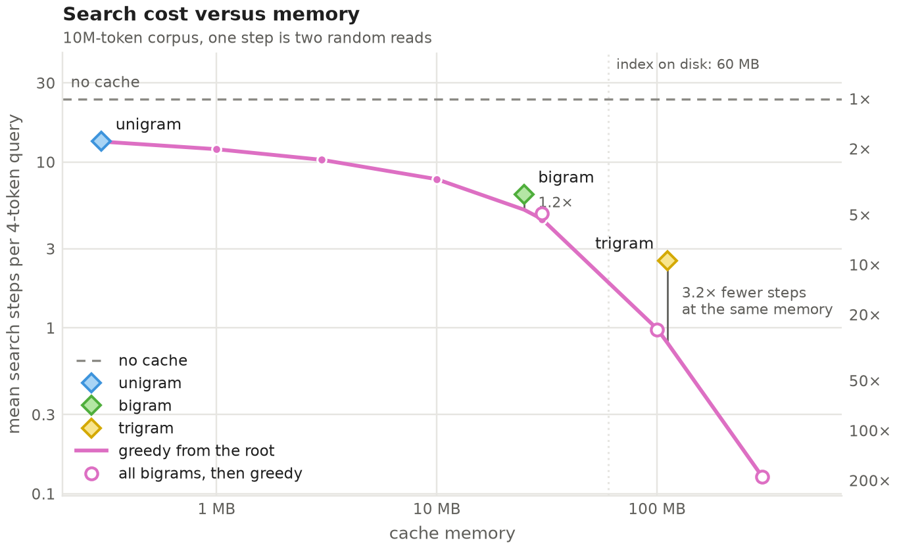
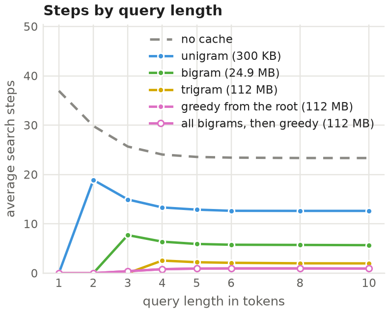

# Optimizing n-grams

Joint work with Zikun Wang and Michael Pimble.

See [Blog Post](https://peter.bio/blog/n-grams)

## What it does

An n-gram count over a tokenized corpus is a binary search over a suffix array, about `log2(N) + log2(count)` steps, and every step is a random read of the table and of the token file.

This experiment measures how much an in-memory cache of n-grams saves: a query looks up its longest cached n-gram and searches only inside that interval.

It compares fixed n-grams (every unigram, bigram or trigram) with a greedy n-gram strategy (every bigram, then the prefix with the largest interval is expanded until a byte budget is reached).

The corpus is C4 tokenized with the Llama 2 tokenizer in infini-gram's index format, and the queries are windows of held-out C4.

## Setup

Install [uv](https://docs.astral.sh/uv/) and make the Llama 2 tokenizer reachable, either through a Hugging Face login with access to `meta-llama/Llama-2-7b-hf` or by pointing `data.tokenizer.path` in the config at a local `tokenizer.json`.

```
scripts/setup.sh    # uv sync
scripts/run.sh      # build the corpus, table, queries and caches, then measure
uv run pytest
```

Every setting is in `configs/config.json`; its `run` section names the corpus (`10M`, `100M` or `1.2B`).
Outputs go to `results/`: `results.json`, `pareto.png` and `steps_by_length.png`.

## Results

On the 10M-token corpus, a 4-token query takes 24 steps without a cache, 2.6 with every trigram cached (112 MB), and 0.8 with the greedy cache at the same memory.

Each step is two random reads.




